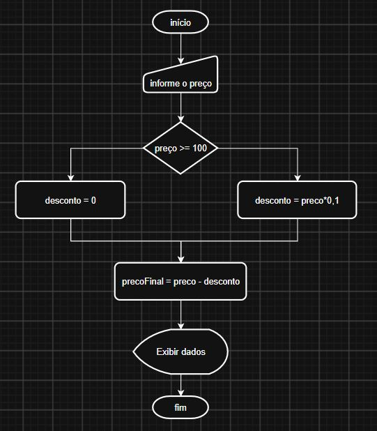

# Estrutura de Decisão — IF e ELSE

## Objetivo

Até agora, nossos programas executavam as instruções em sequência:

```text
Entrada → Processamento → Saída
```

Nesta atividade, vamos aprender a utilizar as estruturas de decisão `if` e `else`.

Com essas estruturas, o programa pode **tomar decisões** e executar diferentes instruções dependendo de uma condição.

```text
              CONDIÇÃO
                 ↓
          ┌──────┴──────┐
         SIM            NÃO
          ↓              ↓
       Instrução      Instrução
```

---

# 1. IF

O `if` significa **"se"**.

Ele permite executar um trecho do programa somente quando uma determinada condição for verdadeira.

## Estrutura básica

```c
if (condição) {
    // código executado quando a condição for verdadeira
}
```

### Exemplo

```c
if (idade >= 18) {
    printf("Maior de idade");
}
```

Nesse exemplo:

- `idade >= 18` é a condição;
- se a condição for verdadeira, o `printf()` será executado;
- se a condição for falsa, o código dentro do `if` não será executado.

---

# 2. ELSE

O `else` significa **"senão"**.

Ele define o que deve acontecer quando a condição do `if` for falsa.

## Estrutura básica

```c
if (condição) {
    // executado se a condição for verdadeira
} else {
    // executado se a condição for falsa
}
```

### Exemplo

```c
if (idade >= 18) {
    printf("Maior de idade");
} else {
    printf("Menor de idade");
}
```

Neste caso, sempre teremos um dos dois caminhos:

```text
              idade >= 18?
                   ↓
            ┌──────┴──────┐
           SIM            NÃO
            ↓              ↓
         MAIOR           MENOR
```

---

# 3. Operadores de comparação

Para criar condições, utilizamos operadores de comparação.

| Operador | Significado |
|---|---|
| `==` | igual a |
| `!=` | diferente de |
| `>` | maior que |
| `<` | menor que |
| `>=` | maior ou igual a |
| `<=` | menor ou igual a |

## Atenção: `=` x `==`

Em C, os operadores `=` e `==` possuem funções diferentes.

### Atribuição

```c
idade = 18;
```

O operador `=` coloca o valor `18` dentro da variável `idade`.

### Comparação

```c
idade == 18
```

O operador `==` verifica se `idade` é igual a `18`.

Portanto:

```c
idade = 18;
```

significa:

> Atribua 18 para idade.

Enquanto:

```c
idade == 18
```

significa:

> Idade é igual a 18?

---

# 4. Como pensar em uma decisão

Antes de escrever um `if`, devemos identificar **qual pergunta o programa precisa responder**.

Por exemplo:

> O aluno foi aprovado?

Essa pergunta pode ser transformada em uma condição:

```text
media >= 6.0
```

Depois identificamos os dois caminhos:

```text
VERDADEIRO → Aprovado
FALSO      → Reprovado
```

Em C:

```c
if (media >= 6.0) {
    printf("Aluno aprovado!");
} else {
    printf("Aluno reprovado!");
}
```

---

# 5. Exemplo 1 — Cálculo da média

Neste exemplo, vamos utilizar o cálculo da média de três notas.

A primeira versão do programa **não possui `if` e `else`**.

Ela apenas recebe as notas, calcula a média e apresenta o resultado.

## Código-base

Copie o código abaixo para o seu arquivo `.c`.

```c
#include <stdio.h>

int main() {

    float nota1;
    float nota2;
    float nota3;
    float media;

    printf("Digite a primeira nota: ");
    scanf("%f", &nota1);

    printf("Digite a segunda nota: ");
    scanf("%f", &nota2);

    printf("Digite a terceira nota: ");
    scanf("%f", &nota3);

    media = (nota1 + nota2 + nota3) / 3;

    printf("Media: %.2f\n", media);

    return 0;
}
```

---

## Entendendo o código

### Variáveis

```c
float nota1;
float nota2;
float nota3;
float media;
```

Criamos quatro variáveis para armazenar:

- primeira nota;
- segunda nota;
- terceira nota;
- média.

---

### Entrada de dados

```c
printf("Digite a primeira nota: ");
scanf("%f", &nota1);
```

O programa solicita a nota e armazena o valor na variável `nota1`.

O mesmo acontece com as outras notas.

---

### Cálculo

```c
media = (nota1 + nota2 + nota3) / 3;
```

A média é calculada somando as três notas e dividindo o resultado por três.

---

### Saída

```c
printf("Media: %.2f\n", media);
```

O resultado da média é apresentado com duas casas decimais.

---

# 6. Adicionando o IF e ELSE

Agora vamos modificar o programa.

Queremos que ele informe se o aluno foi aprovado ou reprovado.

## Regra

Considere que:

```text
Média maior ou igual a 6.0 → APROVADO

Média menor que 6.0 → REPROVADO
```

Antes de escrever o código, precisamos identificar a condição.

### Pergunta

```text
A média é maior ou igual a 6.0?
```

Transformando em uma condição:

```c
media >= 6.0
```

---

## IF

Primeiro podemos criar apenas o `if`:

```c
if (media >= 6.0) {
    printf("Aluno aprovado!\n");
}
```

Isso significa:

> SE a média for maior ou igual a 6.0, mostre "Aluno aprovado!".

Mas ainda não definimos o que acontece quando a condição for falsa.

---

## ELSE

Agora adicionamos o `else`:

```c
if (media >= 6.0) {
    printf("Aluno aprovado!\n");
} else {
    printf("Aluno reprovado!\n");
}
```

Agora temos dois caminhos.

```text
                média >= 6.0?
                      ↓
              ┌───────┴───────┐
             SIM              NÃO
              ↓                ↓
          APROVADO          REPROVADO
```

---

# 7. Código completo — Média

Depois de construir o `if` e o `else` junto com o professor:

```c
#include <stdio.h>

int main() {

    float nota1;
    float nota2;
    float nota3;
    float media;

    printf("Digite a primeira nota: ");
    scanf("%f", &nota1);

    printf("Digite a segunda nota: ");
    scanf("%f", &nota2);

    printf("Digite a terceira nota: ");
    scanf("%f", &nota3);

    media = (nota1 + nota2 + nota3) / 3;

    printf("Media: %.2f\n", media);

    if (media >= 6.0) {
        printf("Aluno aprovado!\n");
    } else {
        printf("Aluno reprovado!\n");
    }

    return 0;
}
```

---

# 8. Exemplo 2 — Cálculo de desconto

Agora vamos utilizar `if` e `else` em um problema que envolve cálculo.

## Regra

Uma loja oferece **10% de desconto** para produtos com preço maior ou igual a R$ 100,00.

Produtos abaixo de R$ 100,00 não recebem desconto.

```text
Preço >= R$ 100,00 → 10% de desconto

Preço < R$ 100,00 → sem desconto
```

---

# 9. Código-base

Começaremos com um código que calcula o desconto para qualquer produto.

Copie o código abaixo:

```c
#include <stdio.h>

int main() {

    float preco;
    float desconto;
    float precoFinal;

    printf("Digite o preco do produto: ");
    scanf("%f", &preco);

    desconto = preco * 10 / 100;

    precoFinal = preco - desconto;

    printf("Preco: R$ %.2f\n", preco);
    printf("Desconto: R$ %.2f\n", desconto);
    printf("Preco final: R$ %.2f\n", precoFinal);

    return 0;
}
```

---

# 10. Identificando o problema

Observe que o código atual sempre calcula 10% de desconto.

Por exemplo:

```text
Preço: R$ 200,00
Desconto: R$ 20,00
Preço final: R$ 180,00
```

Mas existe uma regra:

> Somente produtos com preço maior ou igual a R$ 100,00 recebem desconto.

Então precisamos fazer uma pergunta:

```text
O preço é maior ou igual a 100?
```

A condição será:

```c
preco >= 100
```

---

# 11. Construindo o IF

Começamos com:

```c
if (preco >= 100) {

}
```

Agora colocamos o cálculo do desconto dentro do `if`:

```c
if (preco >= 100) {

    desconto = preco * 10 / 100;
    precoFinal = preco - desconto;

}
```

Isso significa:

> SE o preço for maior ou igual a R$ 100,00, calcule o desconto.

---

# 12. Construindo o ELSE

Agora precisamos definir o que acontece quando o preço for menor que R$ 100,00.

Nesse caso:

```text
Desconto = 0
```

E o preço final continua sendo o preço original:

```text
Preço final = preço
```

Então:

```c
else {

    desconto = 0;
    precoFinal = preco;

}
```

---

# 13. IF + ELSE completo

A estrutura fica:

```c
if (preco >= 100) {

    desconto = preco * 10 / 100;
    precoFinal = preco - desconto;

} else {

    desconto = 0;
    precoFinal = preco;

}
```

---

# 14. Código completo — Desconto

```c
#include <stdio.h>

int main() {

    float preco;
    float desconto;
    float precoFinal;

    printf("Digite o preco do produto: ");
    scanf("%f", &preco);

    if (preco >= 100) {

        desconto = preco * 10 / 100;
        precoFinal = preco - desconto;

    } else {

        desconto = 0;
        precoFinal = preco;

    }

    printf("Preco: R$ %.2f\n", preco);
    printf("Desconto: R$ %.2f\n", desconto);
    printf("Preco final: R$ %.2f\n", precoFinal);

    return 0;
}
```

---

# 15. Fluxograma — Desconto

Antes de programar uma decisão, podemos representá-la utilizando um fluxograma.
<!-- 
```text
                 INÍCIO
                    ↓
              Ler o preço
                    ↓
             Preço >= 100?
              ↙          ↘
            SIM           NÃO
             ↓             ↓
     Calcular 10%       Desconto = 0
       de desconto          ↓
             ↓          Preço final
       Preço final           ↓
             ↓              │
             └──────┬───────┘
                    ↓
              Mostrar dados
                    ↓
                   FIM
``` -->



O fluxograma e o código representam a mesma lógica.

---

# 16. Comparando os dois exemplos

Nos dois programas utilizamos a mesma estrutura:

### Média

```c
if (media >= 6.0) {
    // aprovado
} else {
    // reprovado
}
```

### Desconto

```c
if (preco >= 100) {
    // aplicar desconto
} else {
    // não aplicar desconto
}
```

A estrutura é a mesma.

O que muda é:

- a condição;
- o que acontece quando a condição é verdadeira;
- o que acontece quando a condição é falsa.

---

# 17. Modelo mental

Sempre que encontrar uma situação de decisão, pense:

### 1. Qual pergunta preciso responder?

```text
________________________________
```

### 2. Qual é a condição?

```text
________________________________
```

### 3. O que acontece se for verdadeiro?

```text
________________________________
```

### 4. O que acontece se for falso?

```text
________________________________
```

Depois transforme em:

```c
if (condição) {

    // VERDADEIRO

} else {

    // FALSO

}
```
